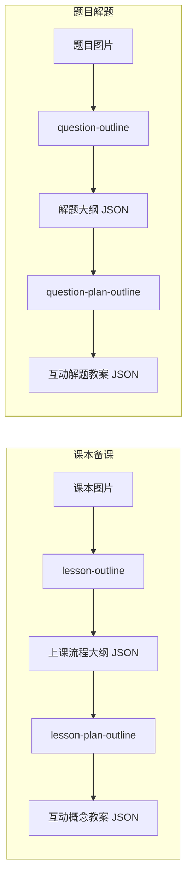

# 初中数学内容生产 Skills

本目录包含四条 **Cursor Agent Skills**，用于把课本与题目材料整理成结构化 JSON，再转成互动课堂可用的分步教案。Skills 为**全局技能**（`~/.cursor/skills/`），在任意工作区均可通过 `@技能名` 调用；对话中由 Agent 直接读图或读 JSON 完成，**不依赖**项目内脚本或外部 API。

## 两条流水线



| 流水线 | 第 1 步 | 第 2 步 |
|--------|---------|---------|
| **课本备课** | 图片 → 上课流程大纲 | 大纲 → 概念课互动教案 |
| **题目解题** | 图片 → 解题步骤大纲 | 大纲 → 解题互动教案 |

---

## Skills 一览

| 目录 | `@` 引用名 | 输入 | 输出 |
|------|------------|------|------|
| [lesson-outline/](lesson-outline/) | `@lesson-outline` | 课本照片/截图 | 按**小标题**拆分的上课流程 JSON |
| [Lesson_Plan_outline/](Lesson_Plan_outline/) | `@lesson-plan-outline` | 上课流程大纲 JSON | 每个小标题一个互动教案 JSON |
| [question_outline/](question_outline/) | `@question-outline` | 数学题图片 | `id` + `outline` + `keyKnowledge` 解题大纲 |
| [question_plan_outline/](question_plan_outline/) | `@question-plan-outline` | 解题大纲 JSON | `题目` + `步骤一/二/…` 互动解题教案 |

---

## 1. lesson-outline（课本 → 上课流程）

**用途**：从初中数学课本图提取「小标题 → 流程一/二… → 讲课内容 + 知识点」。

**触发示例**：

```text
@lesson-outline
（附上课本截图）
提取课本，保存到 output/json/
```

**触发词**：提取课本、上课大纲、备课流程、知识点 JSON、lesson-outline

**输出结构要点**：

- 顶层键 = 课本**小标题**（如 `"圆"`、`"垂直于弦的直径"`）
- 每项：`教学目标`（可选）+ `流程[]`（`流程` / `讲课内容` / `知识点[]`）
- `知识点[].类型`：`定义 | 原理 | 定理 | 性质 | 公式`
- 不含例题流程、不含「如图…」

**默认保存**：`output/json/<小标题>.json`（或用户指定路径）

---

## 2. lesson-plan-outline（上课流程 → 概念互动教案）

**用途**：把 lesson-outline 的大纲转成 AI 互动课格式（参考燕尾模型、垂径定理教案）。

**触发示例**：

```text
@lesson-plan-outline @output/json/圆.json
整理教案，每个小标题单独一个文件
```

**触发词**：整理教案、生成步骤教案、lesson-plan、lesson-plan-outline

**输出结构**：

```json
{
  "题目": "本单元引导题或学习主题",
  "步骤一": {
    "问题": "...",
    "答案": "...",
    "错误提示": "第一次错误：…；第二次错误：…；第三次错误：直接显示正确答案",
    "历史记录": "...",
    "动效描述": "..."
  },
  "步骤二": { }
}
```

- 每个顶层小标题 → **单独一个** JSON 文件
- 一步对应大纲里一条 `流程`；步骤键名为 `步骤一`、`步骤二`（中文数字）

**默认保存**：`output/lesson-plan/<小标题>.json` 或用户指定目录

---

## 3. question-outline（题目图 → 解题大纲）

**用途**：把题目（含解答）压缩成可复用的解题步骤链，**不是**互动教案。

**触发示例**：

```text
@question-outline
（附上题目截图）
提取题目，保存到 json 文件夹
```

**触发词**：题目整理、解题大纲、question outline、题目 JSON、question-outline

**输出结构**：

```json
{
  "id": "Q002_part3",
  "outline": [
    { "step": 1, "title": "审题", "content": "..." }
  ],
  "keyKnowledge": [
    { "name": "阿氏圆", "description": "..." }
  ]
}
```

- `id`：题号或小问，如 `Q002_part3`；无题号时用 `question_outline_001`
- `keyKnowledge` **只有** `name`、`description`（**不要** `relatedSteps`）

**默认保存**：`output/json/<id>_outline.json`

---

## 4. question-plan-outline（解题大纲 → 解题互动教案）

**用途**：把 question-outline 的 JSON 转成与概念课相同的互动步骤格式，用于解题课。

**触发示例**：

```text
@question-plan-outline @json/Q002_part3_outline.json
转成互动解题教案，保存到 json 文件夹
```

**触发词**：题目教案、解题互动步骤、question plan、question-plan-outline

**输出结构**：与 lesson-plan-outline 相同（`题目` + `步骤一/二/…`），但内容来自 `outline[]` 的解题链。

- **不要**在输出中保留 `id`、`outline`、`keyKnowledge`
- 默认文件名：`<id>_plan.json`（如 `Q002_part3_plan.json`）

**默认保存**：与输入同目录，或 `output/json/<id>_plan.json`

---

## 推荐工作流

### 备课（课本）

1. `@lesson-outline` + 课本图 → 得到 `output/json/圆.json` 等
2. `@lesson-plan-outline` + 上一步 JSON → 得到 `output/lesson-plan/圆.json` 等

### 讲题（习题）

1. `@question-outline` + 题目图 → 得到 `Q002_part3_outline.json`
2. `@question-plan-outline` + 上一步 JSON → 得到 `Q002_part3_plan.json`

可在同一条消息里写清「保存路径」，例如：`保存到 D:\doushen\lesson-outline\output\json\`。

---

## 目录结构

```
skills/
├── README.md                 # 本文件
├── lesson-outline/
│   ├── SKILL.md
│   └── references/
├── Lesson_Plan_outline/
│   ├── SKILL.md
│   └── references/
├── question_outline/
│   ├── SKILL.md
│   └── references/
└── question_plan_outline/
    ├── SKILL.md
    └── references/
```

每个 skill 的详细字段规则、禁止项与样例 JSON 见对应目录下的 `SKILL.md` 与 `references/`。

---

## 与项目脚本的关系

- **对话模式**：仅用上述四个 skills，Agent 读图/读 JSON 即可，无需 `extract.py` 或 API Key。
- **批量/自动化**：若项目（如 `lesson-outline`）配有 `extract.py`、`.env` 等，可与 skills 并行使用；改 JSON 规范时请同步更新 skill 内 `references/output-format.md`。

---

## 快速对照：两种输出 JSON 的区别

| 类型 | 典型来源 | 顶层特征 |
|------|----------|----------|
| **流程/解题大纲** | lesson-outline、question-outline | 小标题或 `id` + 步骤数组（`流程[]` / `outline[]`） |
| **互动教案** | lesson-plan-outline、question-plan-outline | `题目` + `步骤一`…`步骤N`，每步五字段 |

互动教案五步字段统一为：**问题、答案、错误提示、历史记录、动效描述**。
